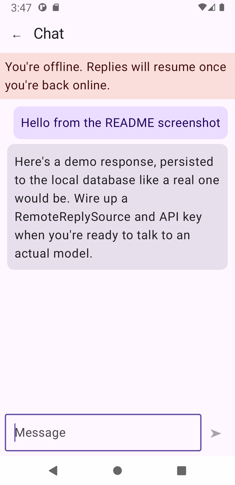
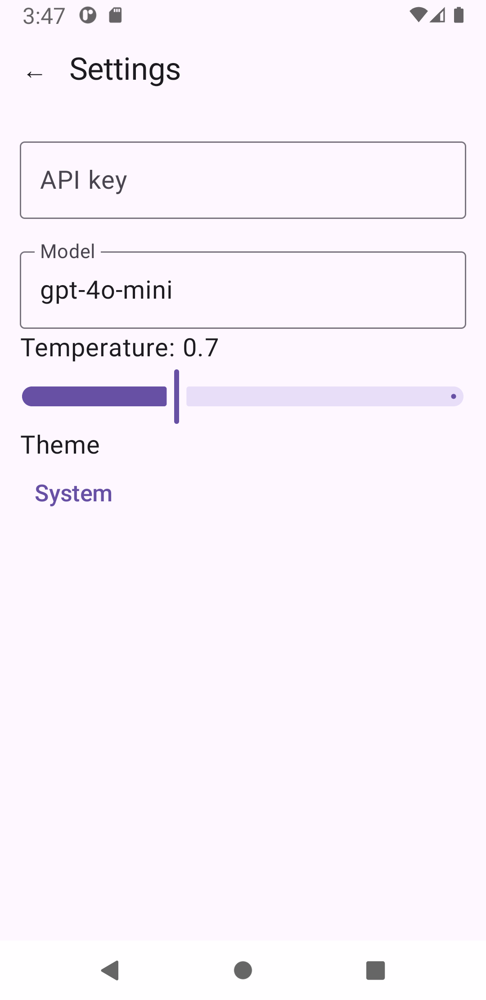
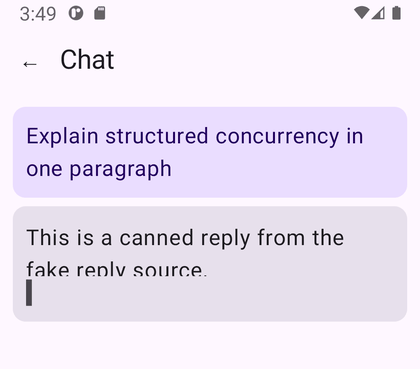
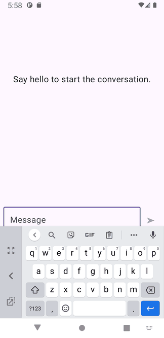
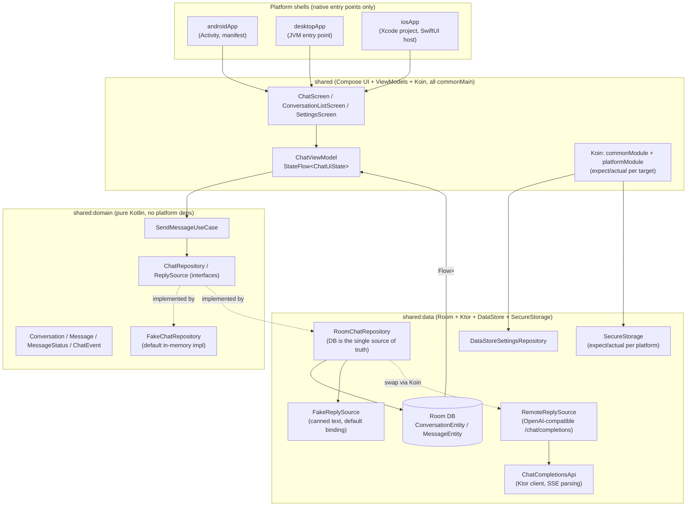

# MyLLMChatKMP

A Kotlin Multiplatform LLM chat app for Android and iOS: one shared Compose UI, one shared
`ChatViewModel`, one shared Room database and Ktor client, driving native shells on each
platform. Streams replies token-by-token over SSE, keeps full history offline, and runs with
zero setup out of the box against a built-in fake backend — no API key required to try it — and
talks to a real model (Groq, or any OpenAI-compatible endpoint) once you add a key in Settings.

## Screenshots

| Conversation list | Chat (streaming, offline banner) | Settings |
| --- | --- | --- |
|  |  |  |

Live against the real [Groq](https://groq.com) API (key and model set in Settings), streaming a reply
to a prompt typed into a new chat:

All screenshots above are from the Android emulator. **iOS screenshots aren't included**: this
project was built in a sandbox with no macOS/Xcode/simulator available, so the iOS side compiles
(including the Kotlin/Native framework) but has never actually been run on-device or in the
simulator — see the `❓ NEEDS HUMAN` notes in [PLAN.md](PLAN_LLM.md) for exactly what that blocks.

The "You're offline" banner in the chat screenshot is a real state the UI renders, not a mockup —
though note it stayed on throughout this emulator session despite the emulator reporting a
validated network connection (`adb shell dumpsys connectivity`), which looks like either an
emulator-specific quirk or a real bug in `AndroidConnectivityObserver`'s first callback; it's
unconfirmed either way and worth a closer look before relying on that banner in production.

## Architecture

**Data flow for one message:** `ChatScreen` dispatches `ChatIntent.Send` → `ChatViewModel` calls
`SendMessageUseCase` → `RoomChatRepository` writes the user message to Room, then collects
`ReplySource.streamReply(...)` (a `Flow<ChatEvent>`), persisting each delta to Room roughly every
50ms (not per-token — see below) → the UI never reads that stream directly, it only observes
`messageDao.observeForConversation(...)` as a `Flow`, so the database is the single source of
truth for what's on screen.

## Decisions and trade-offs

- **Room over SQLDelight.** Both have first-class KMP support; Room's KSP-based DAOs and Flow
  queries needed less boilerplate glue for this project's scope, and its migration story
  (`Migration(1, 2)`) is exercised directly by `MigrationTest`.
- **One `shared` module for presentation, not a fourth Gradle module.** `shared:domain` and
  `shared:data` are real Gradle modules; ViewModels/Compose screens/Koin wiring stay as organized
  packages inside `shared` instead, since that's also where the iOS framework and Compose
  resources are produced — splitting presentation out further would add framework-export
  complexity for little benefit at this project's size.
- **The database is the single source of truth, not the network stream.** `RoomChatRepository`
  persists deltas as they arrive; the UI only ever reads via `observeMessages`. This means killing
  the app mid-stream and reopening it always shows consistent state (the dangling-stream sweep in
  `MessageDao.markDanglingStreamsAsFailed()` handles the interrupted case), at the cost of every
  token round-tripping through the DB instead of flowing UI-only.
- **Batching streamed writes every ~50ms**, not per token. Persisting on every SSE delta would
  mean a DB write every few milliseconds during a fast stream; batching by elapsed time
  (`TimeSource.Monotonic`) cuts that dramatically while keeping the UI feeling live.
- **`FakeReplySource` is the fallback when no API key is saved**, not a test-only fixture. The
  Koin binding is a `ConfiguredReplySource` that uses the real Groq-backed `RemoteReplySource` as
  soon as a key exists in Settings and `FakeReplySource` otherwise, so UI work, and anyone cloning
  the repo, never needs a real API key or network connection to see the app work end-to-end — see
  "Fake-backend mode" below.
- **iOS secure storage is `NSUserDefaults`, not Keychain, and this is a known gap, not an
  oversight.** Real Keychain access needs raw `Security.framework` C interop
  (`SecItemAdd`/`SecItemCopyMatching`), and this project was built in a sandbox with no
  Mac/simulator to verify a read-back actually round-trips correctly. Shipping unverified
  low-level CoreFoundation interop felt riskier than clearly flagging the gap (see the `TODO` in
  `IosSecureStorage.kt` and PLAN.md step 22).
- **ktlint over detekt.** Simpler fit for a project this size; a root `.editorconfig` covers
  formatting rules, with generated Compose-resource/KSP/Room output excluded rather than fought.
- **Kover pinned to 0.9.9, not the newest 0.9.x at the time.** Earlier releases don't support the
  `com.android.kotlin.multiplatform.library` Gradle plugin this project uses for its KMP modules
  ([kotlinx-kover#747](https://github.com/Kotlin/kotlinx-kover/issues/747)); 0.9.8+ fixed it.

## How to run

### Fake-backend mode (default until you add a key)

With no API key saved, the app uses `FakeReplySource` — every build, on every platform, streams
canned replies word-by-word through the exact same pipeline a real model would use (same
persistence, same retry/stop, same error states). This is the fastest way to see the whole app
working:

- **Android:** `./gradlew :androidApp:assembleDebug`, then install the APK, or use your IDE's run
  configuration.
- **Desktop (JVM):**
  - Standard run: `./gradlew :desktopApp:run`
  - Hot reload: `./gradlew :desktopApp:hotRun --auto`
- **iOS:** open [`iosApp/iosApp.xcodeproj`](iosApp/iosApp.xcodeproj) in Xcode and run it from
  there. **Unverified** — see the screenshots section above.

### Talking to a real model (Groq)

`RemoteReplySource` is wired in and is used automatically once an API key is saved. The endpoint
is Groq's OpenAI-compatible API (`https://api.groq.com/openai/v1`, set in `commonModule()`):

1. Create an API key at [console.groq.com](https://console.groq.com/keys).
2. In the app's Settings screen, enter the key — it's persisted through `SecureStorage`
   (`EncryptedSharedPreferences` on Android; see the iOS/JVM caveat above) — and a model ID that
   your account can use (e.g. `llama-3.3-70b-versatile`; Groq retires models over time, so check
   its model list if you get a 404 `model_not_found`).
3. Send a message. Key, model and temperature are read on every request, so no restart is needed.

To use another OpenAI-compatible provider, change `GROQ_BASE_URL` in `commonModule()`. Request
and error details are logged under the `ChatHttp` tag (the API key is redacted).

### Running tests

- All JVM-backed tests, every module: `./gradlew allTests` (equivalent to what CI runs on Ubuntu —
  iOS targets are skipped automatically on Linux since Kotlin/Native simulator tests need macOS)
- Just the Android host tests: `./gradlew :shared:testAndroidHostTest`
- Just the desktop/JVM tests: `./gradlew :shared:jvmTest`
- iOS simulator tests (macOS only): `./gradlew :shared:iosSimulatorArm64Test`
- Lint: `./gradlew ktlintCheck` (`ktlintFormat` to auto-fix)
- Coverage report: `./gradlew koverHtmlReport` → `build/reports/kover/html/index.html`

## Testing and CI

- Domain/use-case logic against fakes: `FakeChatRepositoryTest`
- SSE parsing edge cases (split chunks, empty lines, malformed JSON): `ChatSseParserTest`
- Networking against a mocked HTTP client: `ChatCompletionsApiTest`
- Room migration (1→2) against a real on-disk v1 database: `MigrationTest`
- Full repository integration (real file-backed Room DB + fake reply source together, including
  send/retry/stop): `RoomChatRepositoryTest`
- ViewModel state transitions with Turbine: `ChatViewModelTest`
- End-to-end Compose UI test (real gestures — typing, tapping Send — against the real screen +
  ViewModel): `ChatScreenUiTest`
- `.github/workflows/ci.yml`: ktlint, `allTests`, `androidApp:assembleDebug`, Kover reports, and a
  self-hosted coverage badge on Ubuntu
- `.github/workflows/ios.yml`: iOS framework build (device + simulator) and Kotlin/Native
  simulator tests on macOS

Neither workflow has actually executed yet — both need this repo pushed to GitHub first (and
`ios.yml` needs a real macOS runner, which this sandbox doesn't have) — but every Gradle task they
call has been run and verified locally. See [PLAN.md](PLAN_LLM.md) for the full, dated log of what's
done, what's unverified, and why.

## Project layout

- [`androidApp`](androidApp), [`desktopApp`](desktopApp) — thin native entry points; almost no
  logic lives here.
- [`iosApp`](iosApp) — the Xcode project; the required native entry point even though the UI
  itself is shared.
- [`shared`](shared/src) — Compose UI screens, `ChatViewModel`/`SettingsViewModel`, Koin wiring.
  Platform-specific code (e.g. Keychain/EncryptedSharedPreferences plumbing, the JVM `Dispatchers.Main`
  provider) lives in per-target source sets (`androidMain`, `iosMain`, `jvmMain`).
- [`shared/domain`](shared/domain/src/commonMain) — pure Kotlin: models, `ChatRepository`/
  `ReplySource` interfaces, use cases, and `FakeChatRepository`. No platform dependencies at all.
- [`shared/data`](shared/data/src/commonMain) — Room, Ktor, DataStore, secure storage, and
  connectivity — the concrete implementations of the domain interfaces.

---

Learn more about [Kotlin Multiplatform](https://www.jetbrains.com/help/kotlin-multiplatform-dev/get-started.html).
